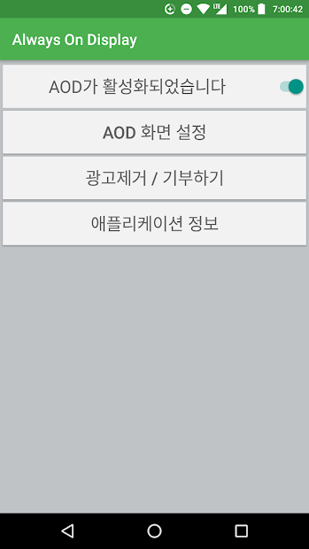
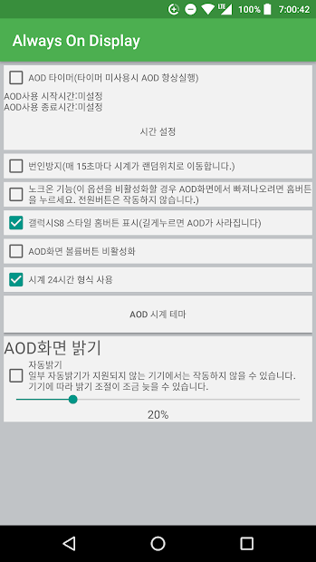

# Always On Display for Android 6+

</img>
</img>

Always On Display 기능이 기본적으로 제공되지 않는 Android 스마트폰에서 Always On Display 기능을 구현합니다.

실제 Always On Display와는 OS의 Deep-Sleep이 지원되지 않는 등 구현 방법에서의 차이가 있기에, 배터리 소모가 증가할 수 있습니다.

Samsung GraceUX, Samsung OneUI, LG 등의 시계 테마를 지원합니다.

***

### Links

[Github](https://github.com/yymin1022/AlwaysOnDisplay) 
[GooglePlay](http://play.google.com/store/apps/details?id=com.yong.aod)

***

### History
* 2016\. 04\. 개발 시작
* 2016\. 06\. V2\.3 배포
* 2017\. 02\. V3\.0 배포
* 2017\. 03\. V3\.3 배포
* 2017\. 05\. V3\.4 배포
* 2017\. 06\. V3\.5 배포
* 2017\. 07\. V3\.6 배포
* 2017\. 08\. V3\.8 배포
* 2017\. 10\. V4\.0 배포
* 2018\. 01\. V4\.1 배포
* 2018\. 11\. V4\.2 배포
* 2019\. 01\. V4\.3 배포
* 2019\. 02\. V4\.4 배포
* 2019\. 10\. V4\.5 배포
